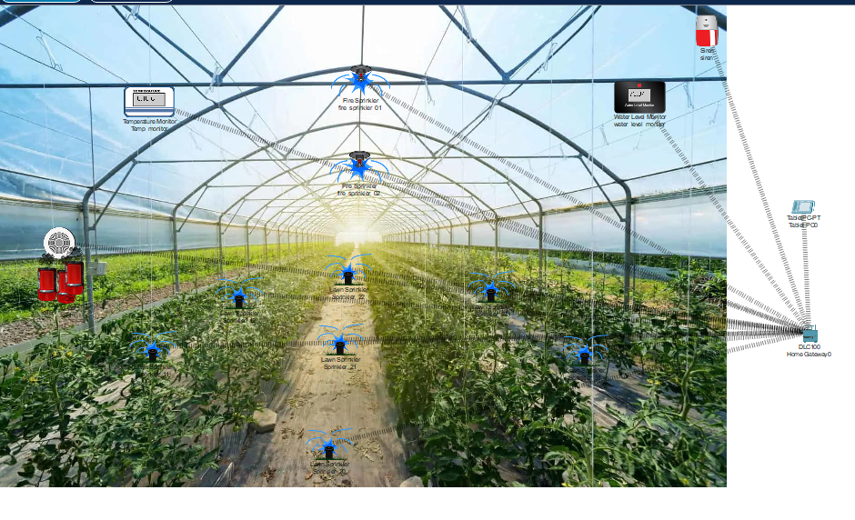

# Smart Greenhouse System Using Cisco Packet Tracer

Welcome to the **Smart Greenhouse System**! This project simulates an automated greenhouse using Cisco Packet Tracer. The system integrates smart irrigation, temperature monitoring, and fire extinguishing capabilities to create a secure and efficient environment for plant growth.

## 🚀 Project Overview

The Smart Greenhouse is designed to automate irrigation, temperature monitoring, and fire safety using smart sensors and controllers within a simulated environment. Key functionalities include:

- **Smart Irrigation System**: Water sprinklers are activated automatically based on soil moisture levels and temperature monitoring.
- **Temperature Monitoring System**: Continuous monitoring of the greenhouse temperature, with alerts and control mechanisms to adjust conditions as needed.
- **Fire Extinguishing System**: Fire sprinklers are activated in the event of a fire, detected through smoke sensors, and accompanied by a siren alarm.

This project is built and simulated using Cisco Packet Tracer, incorporating IoT sensors, controllers, and networking components.

## 📸 Project Image



## 🌟 Features

1. **Water Sprinkler for Smart Irrigation**:
   - Monitors soil moisture and temperature.
   - Automatically waters plants when moisture levels are low or when the temperature rises above a certain threshold.

2. **Temperature Monitoring System**:
   - Real-time monitoring of the temperature inside the greenhouse.
   - Alerts when the temperature exceeds preset thresholds.
   - Automated controls can be configured to adjust the environment when extreme temperatures are detected (e.g., activating cooling or heating systems).

3. **Fire Detection and Extinguishing System**:
   - Smoke sensors detect fire within the greenhouse.
   - Fire sprinklers are triggered when smoke is detected.
   - An audible siren warns of fire hazards.

4. **Automation & Control**:
   - Both the irrigation and fire protection systems are fully automated.
   - Temperature monitoring ensures optimal environmental conditions, with the ability to trigger necessary actions to maintain those conditions.

## 🛠️ Installation & Setup

To simulate and run this project, follow these steps:

1. **Install Cisco Packet Tracer**:
   - Download and install the latest version of [Cisco Packet Tracer](https://www.netacad.com/courses/packet-tracer).

2. **Clone the Repository**:
   - Clone this repository to your local machine using the following command:
     ```bash
     git clone https://github.com/yourusername/smart_green_house_cisco_iot.git
     ```

3. **Open the Project in Cisco Packet Tracer**:
   - Launch Cisco Packet Tracer and open the `.pkt` file located in the repository to view and simulate the Smart Greenhouse setup.

4. **Configure IoT Devices**:
   - Ensure that all IoT devices such as water and fire sprinklers, sensors, temperature monitors, and controllers are correctly configured as per the instructions in the simulation.

## 🚀 Usage

1. **Run the Simulation**:
   - Start the simulation in Cisco Packet Tracer to see the Smart Greenhouse in action.

2. **Test the Smart Irrigation System**:
   - Adjust the soil moisture or temperature sensors to simulate different environmental conditions and observe the automatic activation of water sprinklers.

3. **Test the Temperature Monitoring System**:
   - Modify the temperature inside the greenhouse to see how the system responds.
   - You should receive alerts when the temperature exceeds preset limits, and actions (e.g., turning on fans or cooling) can be triggered as per the configuration.

4. **Test the Fire Extinguishing System**:
   - Simulate a fire by increasing the smoke levels detected by the smoke sensors, and watch the fire sprinklers and siren activate automatically.

## 🖥️ Project Structure

- `Samrt_green_house_01.pkt`: The Cisco Packet Tracer project file.
- `README.md`: Project documentation.
- `images/`: Directory for project images and screenshots (add your project image here).

## 🤝 Contributing

Contributions are welcome! If you'd like to improve this project or add new features, feel free to open a pull request. Please follow the guidelines below:

1. Fork the repository.
2. Create a new branch for your feature or bug fix.
3. Commit your changes.
4. Open a pull request with a description of your changes.

## 📄 License

This project is licensed under the MIT License. See the [LICENSE](./LICENSE) file for details.

## 💡 Acknowledgements

- Cisco Packet Tracer for providing an excellent tool for IoT simulation.
- Inspiration from automated greenhouse systems, smart irrigation, temperature monitoring, and fire safety mechanisms.
